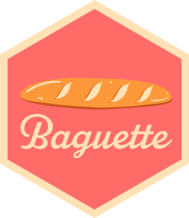

<!-- README.md is generated from README.Rmd. Please edit that file -->

```{r, include = FALSE}
knitr::opts_chunk$set(
  collapse = TRUE,
  comment = "#>",
  fig.path = "man/figures/README-",
  out.width = "100%"
)
```

# baguette <a href="https://baguette.tidymodels.org/"></a>

<!-- badges: start -->
[](https://github.com/tidymodels/baguette/actions/workflows/R-CMD-check.yaml)
[](https://lifecycle.r-lib.org/articles/stages.html#stable)
[](https://cran.r-project.org/package=baguette)
[](https://app.codecov.io/gh/tidymodels/baguette?branch=main)
<!-- badges: end -->

## Introduction

The goal of baguette is to provide efficient functions for bagging (aka bootstrap aggregating) ensemble models.

The model objects produced by baguette are kept smaller than they would otherwise be through two operations:

- The [butcher](https://butcher.tidymodels.org/) package is used to remove object elements that are not crucial to using the models. For example, some models contain copies of the training set or model residuals when created. These are removed to save space.

- For ensembles whose base models use a formula method, there is a built-in redundancy because each model has an identical terms object. However, each one of these takes up separate space in memory and can be quite large when there are many predictors. The baguette package solves this problem by replacing each terms object with the object from the first model in the ensemble. Since the other terms objects are not modified, we get the same functional capabilities using far less memory to save the ensemble.

## Installation

You can install the released version of baguette from [CRAN](https://CRAN.R-project.org) with:

``` r
install.packages("baguette")
```

Install the development version from GitHub with:

``` r
# install.packages("pak")
pak::pak("tidymodels/baguette")
```

## Available Engines

The baguette package provides engines for the models in the following table.

```{r, echo=FALSE, message=FALSE}
library(parsnip)

parsnip_models <- get_from_env("models") %>%
  setNames(., .) %>%
  purrr::map_dfr(get_from_env, .id = "model")

library(baguette)

baguette_models <- get_from_env("models") %>%
  setNames(., .) %>%
  purrr::map_dfr(get_from_env, .id = "model")

dplyr::anti_join(
  baguette_models, parsnip_models, 
  by = c("model", "engine", "mode")
) %>%
  knitr::kable()
```

## Example

Let's build a bagged decision tree model to predict a continuous outcome.

```{r}
library(baguette)

bag_tree() %>% 
  set_engine("rpart") # C5.0 is also available here

set.seed(123)
bag_cars <- 
  bag_tree() %>% 
  set_engine("rpart", times = 25) %>% # 25 ensemble members 
  set_mode("regression") %>% 
  fit(mpg ~ ., data = mtcars)

bag_cars
```

The models also return aggregated variable importance scores.

## Contributing

This project is released with a [Contributor Code of Conduct](https://contributor-covenant.org/version/2/1/CODE_OF_CONDUCT.html). By contributing to this project, you agree to abide by its terms.

- For questions and discussions about tidymodels packages, modeling, and machine learning, please [post on Posit Community](https://forum.posit.co/new-topic?category_id=15&tags=tidymodels,question).

- If you think you have encountered a bug, please [submit an issue](https://github.com/tidymodels/baguette/issues).

- Either way, learn how to create and share a [reprex](https://reprex.tidyverse.org/articles/articles/learn-reprex.html) (a minimal, reproducible example), to clearly communicate about your code.

- Check out further details on [contributing guidelines for tidymodels packages](https://www.tidymodels.org/contribute/) and [how to get help](https://www.tidymodels.org/help/).

